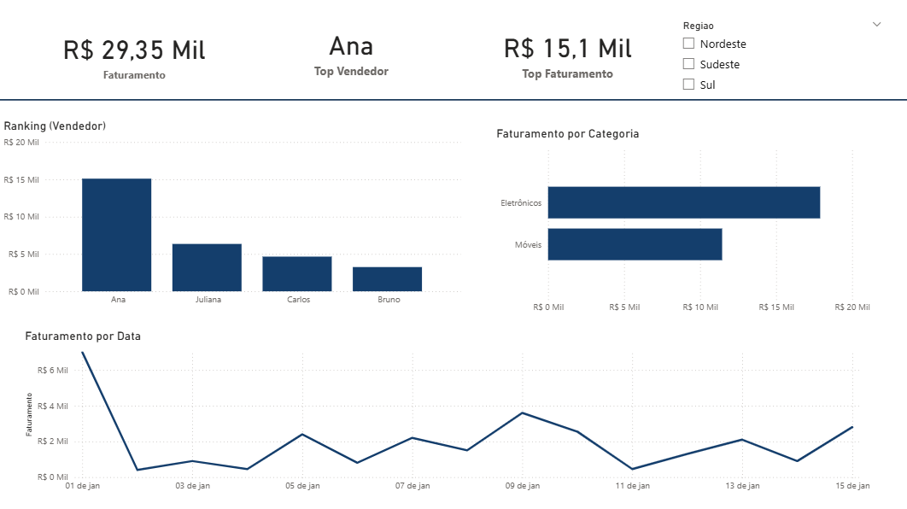

# 📊 Dashboard de Vendas - Power BI

📌 Projeto de análise de vendas com foco em desempenho comercial, identificação do melhor vendedor e comportamento do faturamento ao longo do tempo.

---

## 🎯 Objetivo

Analisar o desempenho de vendas, identificar o melhor vendedor e entender a evolução do faturamento.

---

## 📌 Indicadores Criados

* Faturamento Total
* Top Vendedor
* Faturamento do Top Vendedor
* Ranking de Vendedores
* Faturamento por Categoria
* Faturamento por Data

---

## 🛠️ Ferramentas Utilizadas

* Power BI
* Excel
* DAX

---

## 📈 Insights

* A vendedora Ana apresentou maior faturamento
* A categoria Móveis teve maior volume de vendas
* Crescimento de vendas no final do período
* Diferença de desempenho entre vendedores

---

## 🎛️ Filtros

* Região (Nordeste, Sudeste, Sul)

---

## 📷 Dashboard

Veja meu dashboard aqui: 

---

## 📂 Arquivos

* Dashboard Power BI (.pbix)
* Base de dados (Excel)

---

# 🎯 Atualmente estudando

* SQL
* DAX
* Modelagem de Dados

---

🔗 LinkedIn: https://www.linkedin.com/in/vitoria-bernardes-2332b4345

